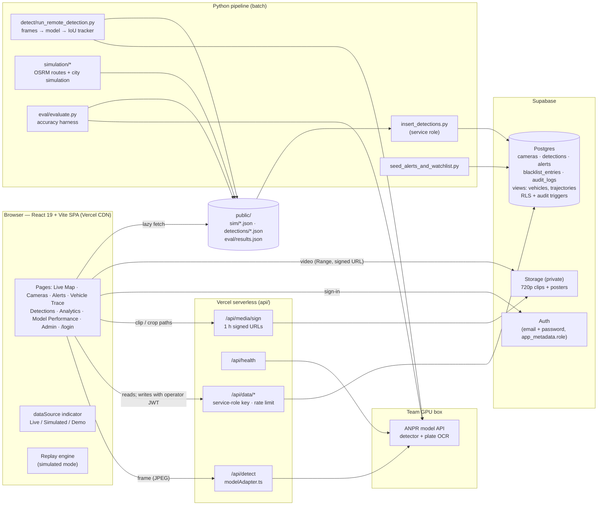
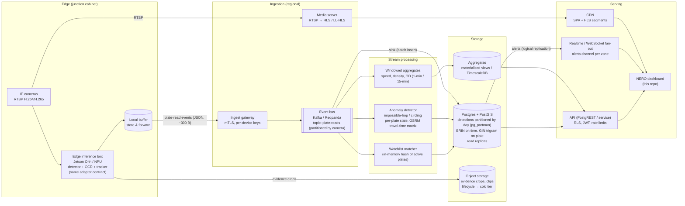

# Architecture

Two views: what runs **today** (the SIH prototype in this repository) and how the same design
**scales out** to a city-wide deployment (thousands of cameras, millions of reads per day).

## 1. Current architecture (prototype)

**Key properties**

| Concern | How it is handled today |
| --- | --- |
| Data source honesty | One `dataSource` (`src/lib/dataSource.ts`): **Live** when `VITE_SUPABASE_URL` is set, else **Simulated** (`public/sim`), else **Demo fixtures**. Live-mode errors are shown, never replaced by fixtures. |
| Model integration | Single adapter contract: `api/_lib/modelAdapter.ts` (browser path, via the Vercel proxy that holds the API key) and its twin `pipeline/detect/adapter.py` (batch). Plugging in the trained model = setting `DETECTION_API_*`. |
| Trajectories | `trajectories` view (one row per plate, consecutive reads at one camera collapsed); client snaps hops to OSRM road geometry. |
| Alerts | Rows in `alerts` (watchlist hits, cloned plate, circling). Live mode polls `/api/data/alerts` every 10 s (CDN-cached 5 s). In simulated mode the replay engine emits the same events. |
| Security | Private database: RLS forced, no anon/authenticated grants, all access through `/api/data` (service key server-side, rate-limited); private buckets with signed URLs; operator/admin writes verified from the JWT role; pipeline uses the service role; audit trigger; 90-day retention (`purge_old_detections`). |
| Performance | Route-level code splitting + preload hints; Supabase SDK loaded on demand; Leaflet only on map pages; clips streamed with HTTP Range, never bundled. |

**Limits of the prototype:** one Postgres, client-side analytics aggregation over one simulated
day, batch (not streaming) detection, clips as MP4 files.

## 2. Production scale-out

Target: a city like Mumbai — ~5,000 ANPR cameras, ~50 M plate reads/day (≈ 600/s average,
3,000/s peak), sub-2-second alert latency, 90-day hot retention.

### Design decisions

1. **Inference at the edge.** Sending video to a data centre costs ~4 Mbit/s per camera
   (20 Gbit/s for 5,000 cameras). An edge box reads plates locally and sends ~300-byte events
   (plate, confidence, bbox, crop URL, camera, time) — three orders of magnitude less bandwidth,
   and reads survive backhaul outages via store-and-forward. The event schema is exactly the
   normalised output of `modelAdapter.ts`, so the dashboard and pipeline don't change.
2. **Event bus as the spine.** Plate reads go to a partitioned Kafka/Redpanda topic (key =
   camera id). Consumers are independent and replayable: the DB sink, the watchlist matcher, the
   anomaly detector and the aggregators scale horizontally by partition. The prototype's replay
   engine is the same idea in miniature.
3. **Alerts in < 2 s.** The watchlist matcher keeps active plates in memory (reloaded on
   `blacklist_entries` changes) and writes `alerts` rows; Realtime pushes only the `alerts` table
   to browsers — `detections` is never broadcast (same rule as the prototype migration
   `20261001000300_alerts_realtime.sql`).
4. **Partitioned Postgres/PostGIS.** `detections` is range-partitioned by day: inserts hit one
   small partition, 90-day retention is `DROP PARTITION` instead of `DELETE`, BRIN indexes on
   time stay tiny, and plate lookups use `(plate_text_normalized, detected_at)` plus trigram GIN.
   PostGIS geometry on cameras enables corridor / zone queries; read replicas serve the dashboard.
5. **Analytics as materialised aggregates.** The client-side `aggregate.ts` logic becomes
   1-minute and 15-minute rollups (speed per hop, counts per camera, OD per zone pair) written by
   the stream aggregators; the Analytics page reads rollups, not raw reads.
6. **Video via HLS + CDN.** Cameras are re-packaged to (LL-)HLS by a media server and cached at
   the CDN; the dashboard's player already streams by URL with a fallback source.
7. **Security and DPDP Act.** Per-device credentials at the edge, mTLS to the gateway, RLS and
   role claims unchanged from the prototype, anon access removed, audit trail on every write and
   on every plate search, retention enforced by partition drops, evidence crops expire with
   object-storage lifecycle rules.

### Capacity sketch

| Component | Sizing for 5,000 cameras / 50 M reads/day |
| --- | --- |
| Edge | 1 box per 4–8 cameras (Orin NX class) |
| Event bus | 3 brokers, 48 partitions, 7-day retention (~100 GB) |
| Postgres | Primary + 2 replicas; ~15 GB/day of detections (+ indexes), 90 days hot ≈ 1.5–2 TB |
| Stream processing | 3–6 consumer instances per job (stateless except anomaly per-plate state, keyed by plate) |
| Realtime | Alerts only: tens of events/min city-wide — trivial fan-out |

### Migration path from the prototype

1. Point `DETECTION_API_*` at the trained model (no code change) and run
   `run_remote_detection.py` on the clips → real `public/detections` and accuracy numbers.
2. Stream mode: run the adapter against RTSP on an edge box; post events to an ingest endpoint
   that inserts into `detections` (service role) — the dashboard already reads the DB path.
3. Move watchlist/anomaly matching from `seed_alerts_and_watchlist.py` into a stream consumer.
4. Partition `detections`, add rollup tables, switch Analytics to read them.
5. Put the event bus in between once one ingest node is no longer enough.
